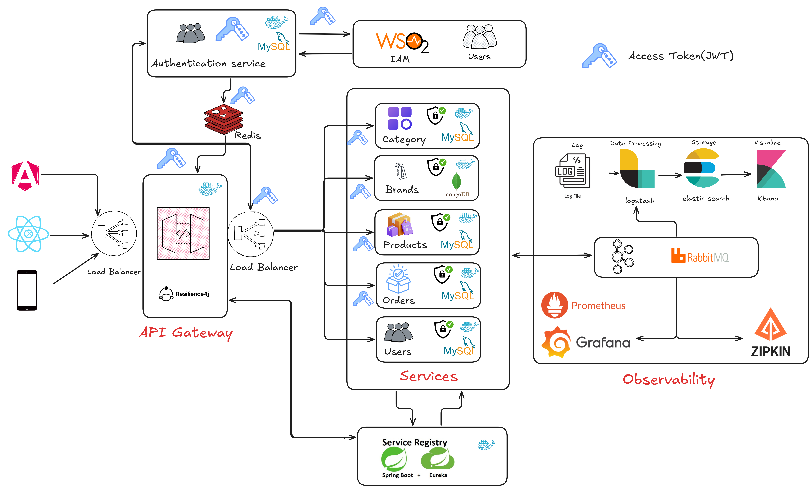

<h1 align="center">🛒 Weshopify Platform (Microservices Edition)</h1>

  <b>Enterprise-grade Microservices backend built using Java & Spring Boot</b> 

<h2>📌 Project Overview</h2>

Weshopify Platform is a <b>Microservices-based E-commerce backend system</b>
built using <b>Spring Boot & Spring Cloud</b>. It implements real-world distributed 
system patterns such as API Gateway, Service Registry, centralized authentication,
token caching, and observability stack.

<ul>
  <li>Architecture: <b>Microservices</b></li>
  <li>Service Interaction: <b>REST</b></li>
  <li>Security: <b>JWT + OAuth2 + WSO2 IAM</b></li>
</ul>

<h2>🏗️ System Architecture</h2>

Below diagram represents the high-level microservices architecture including IAM, Gateway, Registry, Databases, Redis cache and Observability stack.

  <!-- Replace this placeholder with your actual architecture file -->
  

<h2>📦 Services</h2>

<ul>
  <li>👤 User Service</li>
  <li>🔑 Authentication Service</li>
  <li>🏷 Brands Service</li>
  <li>📂 Category Service</li>
  <li>📣 Notification Service</li>
  <li>🚪 API Gateway</li>
  <li>🗂 Service Registry</li>
  <li>🧰 Common Service (Shared Utilities)</li>
</ul>

<h2>✨ Features</h2>

  
<b>🔐 Authentication & Authorization</b>

  Integrated with <b>WSO2 IAM</b> for identity management and JWT issuance.

  
<b>🔑 Token Broker + Redis Token Cache</b>

  Auth-Service delegates authentication to WSO2 and caches tokens in Redis for faster validation.

  
<b>🔀 API Gateway + Routing + Circuit Breaking</b>

  Built with Spring Cloud Gateway & Resilience4j for load-balancing and fault tolerance.

  
<b>🧩 Service Registry + Load Balancing</b>

  Uses Eureka for service discovery and dynamic routing.

  
<b>📊 Distributed Observability</b>

  Includes distributed logging, metrics, and tracing using <b>ELK + Prometheus + Zipkin</b>.

  
<b>🐳 Docker Support</b>

  All services containerized using Docker.

<h2>🛠️ Tech Stack</h2>

<ul>
  <li><b>Languages:</b> Java</li>
  <li><b>Frameworks:</b> Spring Boot, Spring Cloud, Spring Security, Spring Data</li>
  <li><b>Databases:</b> MySQL, MongoDB</li>
  <li><b>Cache:</b> Redis</li>
  <li><b>Security:</b> Spring Security + OAuth2.0 + JWT + WSO2 IAM</li>
  <li><b>Architecture:</b> Microservices Architecture</li>
  <li><b>Containerization:</b> Docker</li>
  <li><b>API Style:</b> REST API</li>
  <li><b>Version Control:</b> Git</li>
  <li><b>Project Management:</b> Jira</li>
  <li><b>Testing:</b> JUnit + Mockito</li>
  <li><b>Monitoring & Logging:</b> ELK (Elasticsearch, Logstash, Kibana), Prometheus, Grafana, Zipkin</li>
  <li><b>Tools:</b> Swagger, Postman, J-Meter</li>
  <li><b>IDEs:</b> IntelliJ, Spring Tool Suite, VS Code</li>
  <li><b>Other Skills:</b> Sendgrid, Agile Methodology</li>
  <li><b>Operating System:</b> Windows</li>
</ul>

<h2>▶️ How to Run</h2>

<b>Option 1 — Run Locally (Standalone JAR)</b>

<pre>
mvn clean install

java -jar service-registry.jar
java -jar api-gateway.jar
java -jar auth-service.jar
java -jar user-service.jar
java -jar brand-service.jar
java -jar category-service.jar
java -jar notification-service.jar
</pre>

<b>Prerequisites:</b>

<ul>
  <li>MySQL</li>
  <li>MongoDB</li>
  <li>Redis</li>
  <li>WSO2 IAM</li>
</ul>

 

<b>Option 2 — Run using Docker</b>

<pre>
docker compose up -d
</pre>

This will start:

<ul>
  <li>All Microservices</li>
  <li>API Gateway</li>
  <li>Service Registry</li>
  <li>Redis Cache</li>
  <li>Databases</li>
</ul>

<h2>👨‍💻 Author</h2>

<b>Yogesh Bhagat</b> 
Software Engineer

